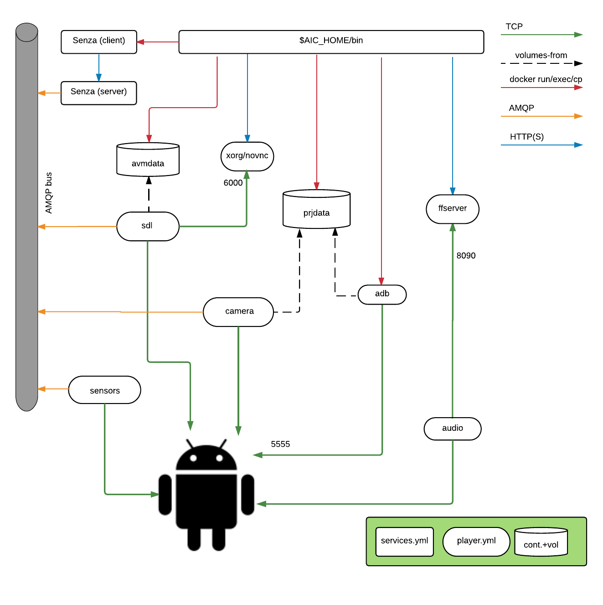

# Installing AiC (local edition)

This repository contains the tools to build and run AiC in a "single host, single user" configuration.


## Prerequisites

A modern linux distribution is required. It should be able to run Docker 1.10+, and qemu-kvm through libvirt.

The Docker images are built upon Ubuntu 16.04, and we assume the host is running Ubuntu 16.04 too, but it
should be easy to install on another distribution.

### Tools

Add the docker repository

```
$ sudo apt-key adv --keyserver hkp://p80.pool.sks-keyservers.net:80 --recv-keys 58118E89F3A912897C070ADBF76221572C52609D
$ echo "deb https://apt.dockerproject.org/repo ubuntu-xenial main" | sudo tee /etc/apt/sources.list.d/docker.list
```

Unfortunately the apt package "docker-compose" is not compatible with
docker-engine, because it depends instead on the docker.io package.
It is therefore installed as a Python package instead. (if you prefer, you can
install it in a virtualenv)

```
$ sudo apt update
$ sudo apt install -y git make python-pip docker-engine libvirt-bin qemu-kvm
$ sudo pip install docker-compose
```

The commands in the next section assume that the current user can run Docker and libvirt.

A simple way to allow that is to add the user to the docker and libvirtd groups:

```
$ sudo adduser $(whoami) docker
$ sudo adduser $(whoami) libvirtd
```

(also logout and login again, to activate the new groups)

These groups might pose a security risk if you share the host with other
projects. Adding an untrusted user to the docker group is equivalent to granting
him root permissions, so you might prefer to manually prepend "sudo" to the
`make` commands and `$AIC_HOME/bin/*` scripts.


## Installation overview


The following components will be deployed:

 - A main directory ($AIC_HOME) to contain scripts, the Android VMs and system images
 - Three Docker containers, shared among all VMs, to provide communication bus and API
 - An arbitrary number of Android x86 VMs, limited by the host's CPU and RAM.
   You can change the default settings in lib/vm_template.xml
 - A set of Docker containers for /each/ VM, to provide rendering and encoding,
   device emulation and a NoVNC UI


## Installing $AIC_HOME

If you haven't yet, choose the location of $AIC_HOME.

```
$ export AIC_HOME=/path/to/local-aic
$ git clone git@github.com:AiC-Project/local-aic.git $AIC_HOME
$ cd $AIC_HOME
```


## Install service and player images

### From binaries

```
$ mkdir -p lib/images
$ curl -Lo lib/images/services.tar https://github.com/AiC-Project/local-aic/releases/download/0.8/services.tar
$ curl -Lo lib/images/player.tar https://github.com/AiC-Project/local-aic/releases/download/0.8/player.tar
$ make docker-load
docker load -i lib/images/services.tar
Loaded image: aic.senza:latest
docker load -i lib/images/player.tar
Loaded image: aic.ffserver:latest
Loaded image: aic.sensors:latest
Loaded image: aic.xorg:latest
Loaded image: aic.prjdata:latest
Loaded image: aic.avmdata:latest
Loaded image: aic.sdl:latest
Loaded image: aic.camera:latest
Loaded image: aic.audio:latest
```


### From sources

```
$ make player-build services-build
cd src; git clone git@github.com:AiC-Project/player.git
Cloning into 'player'...
remote: Counting objects: 91, done.
[...]
Removing intermediate container 10b63f273bd0
Successfully built b15b7d2ef6ff
TAG=dev docker-compose -f lib/docker/services/services.yml build
rabbitmq uses an image, skipping
senza uses an image, skipping
$
```


## Install VM images

### From binaries

```
$ curl -L https://github.com/AiC-Project/ats.rombuild/releases/download/0.8/aic-kitkat.tar | tar xf - -C lib/images/
$ curl -L https://github.com/AiC-Project/ats.rombuild/releases/download/0.8/aic-lollipop.tar | tar xf - -C lib/images/
```

### From sources

See https://github.com/AiC-Project/ats.rombuild


# Running AiC


## Backend services

The VMs need access to a few persistent services:

 - An AMQP server
 - A REST API and CLI command to dispatch events
 - A docker volume to contain APKs and video files

These were written with the multiuser version of AiC in mind, so they are running
in a simplified configuration here.
You need to bring them up, as docker containers, and that's all. Note that rabbitmq
is running with the default password (guest/guest).

```
$ ./bin/services-up
Creating network "services_default" with the default driver
Creating rabbitmq
Creating senza
$ ./bin/project-up
WARNING: The AIC_PROJECT_PREFIX variable is not set. Defaulting to a blank string.
Creating prjdata
$
```


## Creating, listing, deleting VMs

To create a VM and the related player containers, run

```
$ ./bin/vm-create path/to/image
```

For the image path, substitute the folder containing the version of your choice:

| Version         | Image Path                              |
| --------------- | --------------------------------------- |
| 4.4.4 Phone     | ./lib/images/android/aic-kitkat/gobyp   |
| 4.4.4 Tablet    | ./lib/images/android/aic-kitkat/gobyt   |
| 5.1.1 Phone     | ./lib/images/android/aic-lollipop/gobyp |
| 5.1.1 Tablet    | ./lib/images/android/aic-lollipop/gobyt |


The new VM will be assigned a random ID. You can list the VMs with the command

```
$ ./bin/vm-list
ahFu1ief
ooHoh0ib
WaeD8cei
chohCh7f
vum6h8ay
```

VMs can be accessed with the Virtual Machine Manager, but the video output will not
be accessible since it must be decoded by a player service. See "vm-browser" below.
The Virtual Machine Manager displays the boot screen, and that's normal.

Removing a VM is done with

```
$ ./bin/vm-delete vum6h8ay
Removing existing VM: vum6h8ay
[...]
Network services_default is external, skipping
Domain vum6h8ay destroyed

Domain vum6h8ay has been undefined

Virtual machine destroyed.
```

## Connecting to a VM

To interact with the VM with a GUI, run

```
$ ./bin/vm-browser kpbmvzpw
Opening http://kanaka.github.io/noVNC/noVNC/vnc_auto.html?host=localhost&port=32771
Created new window in existing browser session.
```

You should find a new browser tab where you can interact with the Android VM. Sound output
is not enabled in the local version of AiC, though the audio stream is processed and available
via the ffserver container.


To open a shell on the VM, run

```
$ ./bin/vm-adb kpbmvzpw shell
root@gobyp:/ #
```

The fb-adb script will forward any parameter to an "adb" process running in a dedicated container:

```
$ ./bin/vm-adb kpbmvzpw shell getprop wifi.interface
eth1
```
## Transfering files
### Through adb
If you need to transfer files with push/pull/install, the adb process will not have access to the host
filesystem, so it might be better to install the package android-tools-adb with apt.
The IP address of each VM is in ./libs/vms/{vm_id}/ip

```
$ adb connect $(cat lib/vms/kpbmvzpw/ip)
connected to 192.168.122.214:5555
$ adb -s $(cat lib/vms/kpbmvzpw/ip):5555 pull /init
3776 KB/s (413355 bytes in 0.106s)
```
### Installing an apk through Docker and vm-adb
If for some reason you have troubles using the regular adb commands, you can use docker to transfer files to the VM, through the aic.adb container.
```
$ docker cp path/to/file.apk kpbmvzpw_adb:/tmp/
$
```
Then you can install an apk on the VM, using the vm-adb install command.
```
./bin/vm-adb kpbmvzpw install /tmp/file.apk
```

## Interact with the VM sensors

You can emulate the state of the device's sensors, battery etc. by using the "senza"
command.

```
$ ./bin/senza help
usage: senza [--version] [-v | -q] [--log-file LOG_FILE] [-h] [--debug]
             [--config CONFIG] [--debug-requests]

senza

optional arguments:
  --version            show program's version number and exit
  -v, --verbose        Increase verbosity of output. Can be repeated.
  -q, --quiet          Suppress output except warnings and errors.
  --log-file LOG_FILE  Specify a file to log output. Disabled by default.
  -h, --help           Show help message and exit.
  --debug              Show tracebacks on errors.
  --config CONFIG      Configuration file (default: senza-client.ini)
  --debug-requests     Print request details

Commands:
  accelerometer  Send a command to the accelerometer emulator
  battery        Send a command to the battery emulator
  camera         Select a video file to provide as camera input
  complete       print bash completion command
  gps            Send a command to the gps emulator
  gravity        Send a command to the gravity sensor emulator
  gsm call       Send a call command to the GSM emulator
  gsm network    Send a command to the GSM emulator
  gsm registration  Send a gsm registration command to the GSM emulator
  gsm signal     Send a gsm network command to the GSM emulator
  gsm sms        Send a SMS to the GSM emulator
  gyroscope      Send a command to the gyroscope emulator
  help           print detailed help for another command
  light          Send a command to the light sensor emulator
  linear-acc     Send a command to the linear_acc emulator
  magnetometer   Send a command to the magnetometer emulator
  orientation    Send a command to the orientation sensor emulator
  pressure       Send a command to the pressure sensor emulator
  proximity      Send a command to the proximity sensor emulator
  recorder       Send a command to start or stop video recording
  relative-humidity  Send a command to the relative_humidity sensor emulator
  rotation-vector  Send a command to the rotation vector sensor emulator
  schema         Display JSON schema for a given subcommand
  temperature    Send a command to the thermometer emulator
```


A detailed help is available for each subcommand:

```
$ ./bin/senza help battery
usage: senza battery [-h] avm_id level_percent ac_online status

Send a command to the battery emulator

positional arguments:
  avm_id         AVM identifier
  level_percent  battery level (0-100)
  ac_online      0=battery; 1=AC
  status         One of CHARGING, DISCHARGING, NOTCHARGING, FULL, UNKNOWN;
                 default CHARGING
```


## Camera emulation

The emulated camera is initialized with an mpg file, which can be replaced once the VM is running.

To upload and activate a new video:

```
$ ./bin/video-upload newcamera.mpg
$ ./bin/senza camera 0y8ekugp newcamera.mpg
```

The upload is required only once (on the prjdata container) and activated separately for each VM.
The video must not contain an audio track. If the file is a still image, it will be
converted to mpg on the fly.


# Changing parameters

The VM resolution can be changed by setting the environment variables before running vm-create:

```
AIC_PLAYER_WIDTH=800
AIC_PLAYER_HEIGHT=600
```

A too small resolution prevents the virtual machine from booting, and
a too big resolution can have performance issues.


# Communication flow



